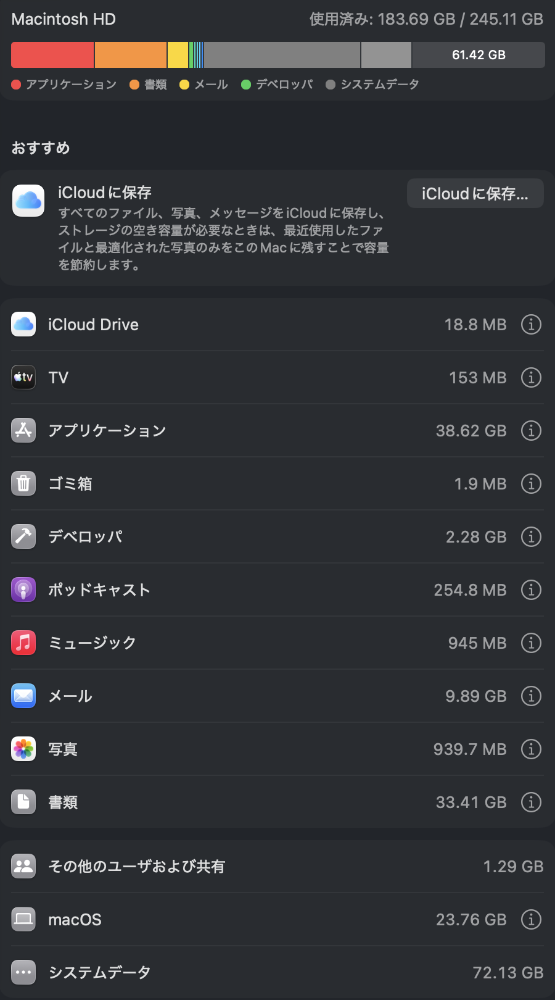
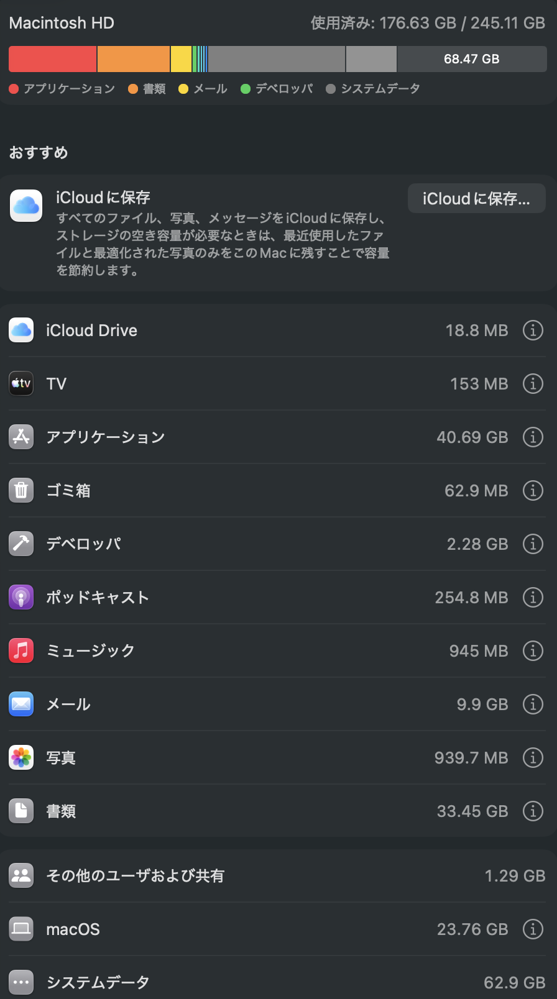

# devpurge

> Purge hidden dev caches on macOS. Reclaim GBs from Claude Desktop, Cursor, node_modules, uv, Playwright, Bun, and 30+ more.

[](LICENSE)
[](https://github.com/sogadaiki/devpurge)

---

## Why devpurge?

Your Mac's "System Data" keeps growing. Tools like CleanMyMac have no idea what Claude Desktop, Cursor, uv, or Playwright are — let alone where they hide gigabytes of cached data.

**devpurge** knows exactly where AI-era dev tools store their bloat, and safely removes it.

```
$ devpurge -n

  devpurge v0.2.0
  Purge hidden dev caches on macOS

  Scanning cache directories...

  #     Tier      Size      Description
  ──    ────────  ────────  ───────────────────────────────────
  N01   Project   6.3G      node_modules (my-app)
  N02   Project   2.1G      node_modules (dashboard)
  A04   AI-Era    4.2G      uv Python cache
  A01   AI-Era    1.8G      Claude Desktop VM bundles
  D10   DevTool   3.1G      Xcode DerivedData
  D01   DevTool   890M      npm cache
  D21   DevTool   302M      npm npx cache

  Total reclaimable: 18.7G
```

## Real Results

On one machine, **45GB recovered** — from 221GB down to 176GB:

| Before (221 GB used) | After (176 GB used) |
|--------|-------|
|  |  |

## Install

### Homebrew (recommended)

```bash
brew tap sogadaiki/devpurge
brew install devpurge
```

### curl

```bash
curl -fsSL https://raw.githubusercontent.com/sogadaiki/devpurge/main/install.sh | bash
```

### Manual

```bash
git clone https://github.com/sogadaiki/devpurge.git ~/.devpurge
ln -sf ~/.devpurge/bin/devpurge /usr/local/bin/devpurge
```

## Usage

```bash
# Scan only (dry run) — see what's there without deleting
devpurge -n

# Interactive cleanup — scan, review, confirm, delete
devpurge

# Auto-confirm + generate share text
devpurge -y -s

# AI-era caches only
devpurge --ai-only

# Include everything (Notion, Discord, Slack, etc.)
devpurge -a

# Exclude specific paths
devpurge --exclude ~/Projects/my-app/node_modules

# Multiple excludes
devpurge --exclude ~/Projects/app1/node_modules --exclude ~/Projects/app2/node_modules
```

### Options

| Flag | Description |
|------|-------------|
| `-n, --dry-run` | Scan only, don't delete anything |
| `-a, --all` | Include caution-level caches |
| `-y, --yes` | Skip confirmation prompt |
| `-s, --share` | Generate shareable summary after cleanup |
| `--exclude PATH` | Exclude path from scanning (repeatable) |
| `--ai-only` | AI-era caches only |
| `--no-color` | Disable colored output |
| `-v, --version` | Show version |
| `-h, --help` | Show help |

## Cache Targets

### Project (v0.2.0 new)

| ID | Target | Typical Size |
|----|--------|-------------|
| N01+ | node_modules in your projects | 1GB - 10GB+ |

Automatically scans `~/Desktop`, `~/Documents`, `~/Projects`, `~/Developer`, etc. for `node_modules` directories. Recoverable with `npm install`.

### AI-Era (no other tool covers these)

| ID | Target | Typical Size |
|----|--------|-------------|
| A01 | Claude Desktop VM bundles | 500MB - 2GB |
| A02 | Cursor IDE cache | 200MB - 1GB |
| A03 | Cursor cached data | 300MB - 1GB |
| A04 | uv Python cache | 500MB - 5GB |
| A05 | Playwright browsers | 500MB - 2GB |
| A06 | Puppeteer browsers | 500MB - 2GB |
| A07 | Bun package cache | 200MB - 2GB |

### Standard Dev Tools

npm, Homebrew, Chrome (browser cache + Service Workers + IndexedDB), VS Code, pip, Cargo, Gradle, Maven, Xcode DerivedData, iOS Simulator, Go build cache, npm npx cache, system logs, Adobe media cache.

### Caution (use `--all`)

Notion, Discord, Slack, Adobe Fonts, Adobe CoreSync, Filmora, Steam.

## vs CleanMyMac / OnyX / Other Tools

| Feature | devpurge | CleanMyMac | OnyX |
|---------|----------|------------|------|
| Claude Desktop cache | Yes | No | No |
| Cursor IDE cache | Yes | No | No |
| uv / Bun / Playwright | Yes | No | No |
| node_modules auto-scan | Yes | No | No |
| Xcode DerivedData | Yes | Yes | Yes |
| npm / pip / Cargo | Yes | Partial | No |
| Free & open source | Yes | No ($35/yr) | Yes |
| No GUI needed | Yes | No | No |
| Zero dependencies | Yes | No | No |

## Config File

Create `~/.devpurgerc` to permanently exclude paths:

```
# Keep active project dependencies
exclude=~/Desktop/development/my-app/node_modules
exclude=~/Desktop/development/dashboard/node_modules
```

CLI `--exclude` flags are merged with config file entries.

## Safety

- Static targets are limited to a hardcoded whitelist
- node_modules scanning is dynamic but restricted to `$HOME` and whitelisted by path pattern
- Never uses `sudo`
- Permission errors are skipped, not forced
- All paths are absolute and double-quoted
- Interactive confirmation by default (use `--yes` to skip)
- Dry run mode (`--dry-run`) for safe scanning

## Share Your Results

After cleanup, use `--share` to generate a ready-to-post summary:

```
I just purged 7.2GB of hidden dev caches with devpurge

Claude Desktop: 2.1GB
uv Python: 1.8GB
Playwright: 1.2GB
+ 8 more

Your Mac is hoarding AI-era bloat. Check yours:
https://github.com/sogadaiki/devpurge
#devpurge
```

Add a badge to your README:

```markdown
[](https://github.com/sogadaiki/devpurge)
```

## Requirements

- macOS (any version with Bash 3.2+)
- No dependencies. Pure Bash.

## License

MIT
